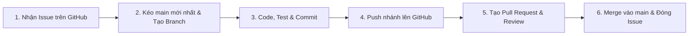

# QUY TRÌNH PHỐI HỢP LÀM VIỆC NHÓM TRÊN GITHUB (TEAM COLLABORATION WORKFLOW)

> **Dự án:** Detecting the Spread of Misinformation in Social Network (Mở rộng Temporal Tree Transformer với User Credibility)  
> **Nhóm thực hiện:** Nhóm 6 — Môn học: Mạng Xã Hội  
> **Mục tiêu:** Đảm bảo toàn bộ 5 thành viên làm việc đồng bộ, không bị ghi đè (conflict) code của nhau, giữ lịch sử Git sạch đẹp và bảo vệ repo an toàn.

---

## 📌 3 NGUYÊN TẮC VÀNG (GOLDEN RULES)

1. **TUYỆT ĐỐI KHÔNG commit/push trực tiếp vào nhánh `main`:**
   - Nhánh `main` là nhánh sản phẩm hoàn thiện, chạy ổn định. Mọi thay đổi bắt buộc phải đi qua **nhánh phụ (feature branch)** và tạo **Pull Request (PR)** để được review trước khi merge.
2. **TUYỆT ĐỐI KHÔNG commit file dữ liệu nặng (> 50MB):**
   - Các file như `text_embeddings.pt`, `pheme_processed.pkl`, checkpoint `best_model.pth` đã có trong `.gitignore`. Không dùng lệnh ép buộc `git add -f`. Các file nặng bắt buộc chia sẻ qua **GitHub Releases** theo [Mục 4.4 của TODO.md](TODO.md#quy-trinh-releases).
3. **MỖI TASK = 1 GITHUB ISSUE = 1 NHÁNH RIÊNG:**
   - Không làm gộp nhiều việc không liên quan vào cùng một nhánh.

---

## 🚀 QUY TRÌNH 6 BƯỚC TỪ KHI NHẬN TASK ĐẾN HOÀN THÀNH



---

### BƯỚC 1: Nhận nhiệm vụ trên GitHub Issues
1. Truy cập vào mục **Issues** trên repo: `https://github.com/tphu2029/SNA_EnhancingTTT-via-User-Credibility-Integration-for-Social-Media-Rumor-Detection/issues`.
2. Tìm Issue được phân công cho mình (hoặc tự gán tên mình vào ô **Assignees** ở cột bên phải).
3. Đọc kỹ phần **DESCRIPTION**, dữ liệu đầu vào và các checklist trong Issue để nắm rõ tiêu chí hoàn thành (Definition of Done).
4. *Ghi nhớ số thứ tự của Issue* (Ví dụ: `#1`, `#2`, `#3`...).

---

### BƯỚC 2: Cập nhật `main` mới nhất & Tạo nhánh mới (Branching)

Trước khi bắt đầu code bất kỳ tính năng nào, bạn cần đảm bảo máy mình đang ở code mới nhất của nhóm:

```powershell
# 1. Chuyển về nhánh main
git checkout main

# 2. Kéo code mới nhất từ GitHub về máy
git pull origin main

# 3. Tạo và chuyển sang nhánh mới cho task của bạn
git checkout -b <tên-nhánh-chuẩn>
```

#### 🏷️ Quy chuẩn đặt tên nhánh (Branch Naming Convention):
Format: `<tiền-tố>/issue-<số-issue>-<tên-ngắn-gọn>`

| Tiền tố | Mục đích | Ví dụ tên nhánh |
| :--- | :--- | :--- |
| `feat/` | Phát triển tính năng mới, pipeline, mô hình mới | `feat/issue-1-offline-embeddings`<br>`feat/issue-2-tree-dataloader`<br>`feat/issue-4-ucttt-model` |
| `exp/` | Chạy thực nghiệm, ablation, benchmark | `exp/issue-3-ttt-baseline`<br>`exp/issue-5-ablation-study` |
| `analysis/`| Phân tích dữ liệu, thống kê, vẽ biểu đồ, case study | `analysis/issue-6-user-eda`<br>`analysis/issue-7-error-cases` |
| `docs/` | Viết tài liệu, báo cáo, cập nhật README, slide | `docs/issue-8-final-report` |
| `fix/` | Sửa lỗi bug phát sinh | `fix/dataloader-cuda-oom` |

---

### BƯỚC 3: Lập trình, Kiểm thử cục bộ & Commit

Trong quá trình làm việc trên nhánh của mình:
1. Thường xuyên chạy kiểm thử (run script, verify output shape, test testcase) để đảm bảo code chạy không lỗi.
2. Kiểm tra những file đã thay đổi trước khi commit:
   ```powershell
   git status
   ```
3. Thêm các file thay đổi vào staging:
   ```powershell
   git add experiments/extract_text_embeddings.py
   # hoặc git add . (LƯU Ý: kiểm tra kỹ git status trước khi add tất cả!)
   ```

#### ✍️ Quy chuẩn viết Commit Message (Conventional Commits):
Format: `<loại>(<phạm vi>): <mô tả ngắn gọn bằng tiếng Việt hoặc tiếng Anh>`

- `feat:` Khi thêm tính năng mới, script mới (ví dụ: `feat(data): add offline text embedding extraction script`)
- `exp:` Khi chạy xong thực nghiệm hoặc lưu kết quả (ví dụ: `exp(baseline): log 9-fold LOEO results for original TTT`)
- `fix:` Khi sửa lỗi (ví dụ: `fix(model): resolve tensor mismatch in gated fusion`)
- `docs:` Cập nhật tài liệu, README, báo cáo (ví dụ: `docs(todo): update workflow and issue descriptions`)
- `refactor:` Tối ưu cấu trúc code mà không đổi logic (ví dụ: `refactor(dataset): optimize collate_fn memory usage`)

Ví dụ commit chuẩn:
```powershell
git commit -m "feat(data): implement offline embedding extraction with MiniLM"
```

---

### BƯỚC 4: Đẩy nhánh lên GitHub (Push Branch)

Sau khi đã hoàn thành và test xong trên máy:

```powershell
# Lần đầu tiên đẩy nhánh này lên GitHub:
git push -u origin <tên-nhánh-của-bạn>

# Ví dụ cụ thể:
git push -u origin feat/issue-1-offline-embeddings
```
*(Từ các lần push sau trên cùng nhánh này, bạn chỉ cần gõ ngắn gọn `git push`)*.

---

### BƯỚC 5: Mở Pull Request (PR) & Yêu cầu Review

Sau khi push nhánh lên GitHub, bạn lên trình duyệt để tạo **Pull Request** ghép code vào `main`:

1. Vào repo trên GitHub, bạn sẽ thấy banner màu vàng: **"Compare & pull request"** $\rightarrow$ Bấm vào nút đó.
2. Điền thông tin Pull Request:
   - **Title (Tiêu đề PR):** Ghi rõ tên tính năng kèm loại (Ví dụ: `feat(data): Xây dựng script trích xuất Offline Text Embeddings`).
   - **Description (Mô tả PR):** Tóm tắt những gì bạn đã làm, kèm **từ khóa liên kết để GitHub tự động đóng Issue**:
     ```markdown
     ### Tóm tắt công việc:
     - Đã viết script `experiments/extract_text_embeddings.py`.
     - Trích xuất thành công 111,000 tweets sang vector 384-d bằng MiniLM-L6-v2.
     - Đã test kiểm tra kích thước tensor và upload file lên Releases v0.1-data-cache.

     ### Liên kết Issue:
     Closes #1
     ```
     *(Khi dùng từ khóa `Closes #1` hoặc `Fixes #1`, ngay khi PR được merge vào `main`, Issue #1 sẽ tự động chuyển sang màu tím Closed!)*
3. **Chỉ định Reviewers:**
   - Ở cột bên phải, mục **Reviewers**, chọn Trưởng nhóm (`@tphu2029`) hoặc thành viên phối hợp với bạn để review code.
4. Bấm **Create pull request**.

---

### BƯỚC 6: Review, Merge vào `main` & Dọn dẹp nhánh

1. **Reviewer:**
   - Người được gán review sẽ vào tab **Files changed** trên PR, xem lại các thay đổi xem code có sạch không, có vô tình commit file nặng nào không.
   - Nếu đạt yêu cầu: Bấm **Review changes** $\rightarrow$ **Approve** $\rightarrow$ Bấm nút xanh **Merge pull request** (chọn *Squash and merge* hoặc *Create a merge commit*).
2. **Sau khi PR đã được Merge thành công:**
   - Bấm nút **Delete branch** trên GitHub để giữ repo gọn gàng.
3. **Cập nhật máy cục bộ của bạn về trạng thái mới nhất:**
   ```powershell
   git checkout main
   git pull origin main
   git branch -d <tên-nhánh-vừa-xong>
   ```

---

## ⚠️ CÁCH XỬ LÝ KHI BỊ XUNG ĐỘT CODE (MERGE CONFLICTS)

Nếu có một bạn khác vừa merge code vào `main` trước bạn và file bạn sửa bị xung đột:

1. Chuyển về nhánh của bạn:
   ```powershell
   git checkout feat/nhanh-cua-ban
   ```
2. Kéo code mới nhất của `main` vào nhánh của bạn:
   ```powershell
   git fetch origin
   git merge origin/main
   ```
3. Nếu Git báo `CONFLICT`:
   - Mở VS Code: VS Code sẽ tô màu các dòng xung đột (`Current Change` vs `Incoming Change`).
   - Chọn giữ code nào (hoặc kết hợp cả hai), sau đó lưu file lại.
4. Chạy lệnh hoàn tất merge:
   ```powershell
   git add <cac-file-da-fix>
   git commit -m "fix: resolve merge conflicts with main"
   git push origin feat/nhanh-cua-ban
   ```
   PR trên GitHub sẽ tự động hết xung đột và có thể merge bình thường.

---

## 📦 QUY TRÌNH CHIA SẺ FILE NẶNG (> 100MB)

- **Khi tạo file nặng (`text_embeddings.pt`, `pheme_processed.pkl`, checkpoint model):**
  - Đảm bảo file nằm trong thư mục đã được `.gitignore` chặn (`data/processed/*.pt`, `data/processed/*.pkl`, `results/checkpoints/*.pth`).
  - Lên tab **Releases** trên GitHub $\rightarrow$ Tạo release mới (ví dụ tag: `v0.1-data-cache`) $\rightarrow$ Kéo thả file đính kèm lên đó.
- **Khi thành viên khác cần file:**
  - Tải trực tiếp từ mục **Releases** trên GitHub hoặc chạy lệnh PowerShell:
    ```powershell
    Invoke-WebRequest -Uri "https://github.com/tphu2029/SNA_EnhancingTTT-via-User-Credibility-Integration-for-Social-Media-Rumor-Detection/releases/download/v0.1-data-cache/text_embeddings.pt" -OutFile "data/processed/text_embeddings.pt"
    ```

---

## 📋 BẢNG TỔNG HỢP LỆNH GIT THƯỜNG DÙNG (CHEATSHEET)

| Thao tác | Câu lệnh PowerShell / Git Bash |
| :--- | :--- |
| Xem trạng thái hiện tại | `git status` |
| Xem danh sách nhánh | `git branch` |
| Cập nhật code mới nhất từ main | `git checkout main` rồi `git pull origin main` |
| Tạo và sang nhánh mới | `git checkout -b <tên-nhánh>` |
| Lưu thay đổi vào staging | `git add <tên-file>` |
| Lưu commit với ghi chú | `git commit -m "<nội-dung-commit>"` |
| Đẩy nhánh lên GitHub lần đầu | `git push -u origin <tên-nhánh>` |
| Đẩy các commit tiếp theo | `git push` |
| Hủy bỏ thay đổi chưa commit | `git restore <tên-file>` |
| Xóa nhánh cục bộ sau khi merge | `git branch -d <tên-nhánh>` |
