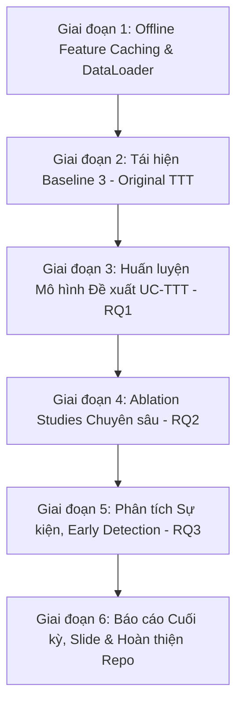

# KẾ HOẠCH TRIỂN KHAI TOÀN DIỆN DỰ ÁN (PROJECT MASTER PLAN)

**Mã và Tên đề tài:** Detecting the Spread of Misinformation in Social Network  
**Hướng nghiên cứu:** Mở rộng Temporal Tree Transformer (TTT) với User Credibility Features trên bộ dữ liệu PHEME  
**Môn học:** Mạng Xã Hội | **GVHD:** TS. Trần Hưng Nghiệp  
**Nhóm thực hiện:** Nhóm 6  
- 23521188 - Trần Thiên Phú (Nhóm trưởng)  
- 23520620 - Mạc Nguyễn Gia Huy  
- 23520278 - Võ Tấn Đạt  
- 23520910 - Nguyễn Thị Thanh Mai  
- 23521239 - Bùi Phạm Bích Phương  

---

## 1. TỔNG QUAN HIỆN TRẠNG DỰ ÁN (MILESTONES ĐÃ HOÀN THÀNH)

Tính đến thời điểm hiện tại, nhóm đã hoàn thành toàn bộ phần móng kỹ thuật:
1. **Dữ liệu PHEME:**
   - Dữ liệu thô đặt tại [`data/raw/PHEME_veracity/all-rnr-annotated-threads/`](file:///e:/UIT/MXH/PJ/data/raw/PHEME_veracity/all-rnr-annotated-threads/) (đã dọn sạch rác OS).
   - Bộ tiền xử lý [`pheme_parser.py`](file:///e:/UIT/MXH/PJ/src/data/pheme_parser.py) đã bóc tách toàn bộ **6,425 threads** (2,402 Rumours / 4,023 Non-rumours) trải rộng trên 9 sự kiện.
   - Xuất dữ liệu trực quan: [`events_summary.csv`](file:///e:/UIT/MXH/PJ/data/processed/events_summary.csv), [`threads_summary.csv`](file:///e:/UIT/MXH/PJ/data/processed/threads_summary.csv), và cache PyTorch [`pheme_processed.pkl`](file:///e:/UIT/MXH/PJ/data/processed/pheme_processed.pkl).
2. **Kỹ nghệ đặc trưng User Credibility:**
   - Hoàn thành module [`user_feature_builder.py`](file:///e:/UIT/MXH/PJ/src/data/user_feature_builder.py) trích xuất đủ 12 đặc trưng (Profile Verification, Engagement Counts với Log-scale, Derived Ratios).
3. **Đánh giá 2 Mô hình Cơ sở (9-Fold Leave-One-Event-Out):**
   - Đã chạy và lưu kết quả tại [`baseline_results.json`](file:///e:/UIT/MXH/PJ/results/baseline_results.json):
     - **B1a (TF-IDF + LR, Source-only):** Pooled Acc 71.77%, Pooled F1 67.56% (Mean LOEO F1 56.17%).
     - **B1b (TF-IDF + LR, Source+Reactions):** Pooled Acc 70.60%, Pooled F1 65.67% (Mean LOEO F1 52.85%).
     - **B2 (Propagation Features + RF):** Pooled Acc 56.62%, Pooled F1 55.62% (Mean LOEO F1 46.12%).
4. **Xây dựng Mô hình Học Sâu PyTorch:**
   - Đã code hoàn chỉnh các khối kiến trúc: [`user_encoder.py`](file:///e:/UIT/MXH/PJ/src/models/user_encoder.py), [`tree_transformer.py`](file:///e:/UIT/MXH/PJ/src/models/tree_transformer.py), [`temporal_gru.py`](file:///e:/UIT/MXH/PJ/src/models/temporal_gru.py), [`ucttt_classifier.py`](file:///e:/UIT/MXH/PJ/src/models/ucttt_classifier.py).
   - Đã kiểm thử forward pass thành công trên CUDA GPU.
5. **Quản lý mã nguồn:**
   - Đã tạo Git, cấu hình `.gitignore` chuẩn và đẩy lên GitHub: `https://github.com/tphu2029/SNA_EnhancingTTT-via-User-Credibility-Integration-for-Social-Media-Rumor-Detection.git`.

---

## 2. KẾ HOẠCH HÀNH ĐỘNG CHI TIẾT TỪ BÂY GIỜ ĐẾN CUỐI KỲ

### Giai đoạn 1: Offline Text Feature Caching & PyTorch DataLoader
* **Mục tiêu:** Tạo vector biểu diễn ngữ nghĩa của văn bản tweet và xây dựng pipeline nạp dữ liệu tốc độ cao.
* **Nhiệm vụ cụ thể:**
  1. Sử dụng Pretrained Sentence Transformer (ví dụ: `all-MiniLM-L6-v2` hoặc `DeBERTa-v3-small`) để trích xuất offline embedding cho toàn bộ tweet gốc và reactions (giúp quá trình train mô hình nhanh gấp 20 lần so với fine-tune trực tiếp).
  2. Viết class `PHEMETreeDataset` và hàm `collate_fn` gom batch động: padding độ dài cây, tạo adjacency reachability matrix, chia time windows.
* **Thời hạn:** Tuần này
* **Phụ trách chính:** Mạc Nguyễn Gia Huy, Võ Tấn Đạt.

---

### Giai đoạn 2: Huấn luyện & Tái hiện Baseline 3 — Original TTT (Wu et al. 2025)
* **Mục tiêu:** Tái lập kết quả của mô hình Temporal Tree Transformer gốc làm thước đo đối chứng chính thức.
* **Nhiệm vụ cụ thể:**
  1. Viết script huấn luyện `train_ttt_baseline.py` với cấu hình `use_user_credibility=False`.
  2. Thiết lập cơ chế chia 9-fold LOEO: Mỗi fold dùng 7 events để train, 1 event làm validation (early stopping theo Validation Macro-F1), 1 event làm test.
  3. Tinh chỉnh siêu tham số (*Hyperparameter Tuning*): learning rate ($1e-4 \rightarrow 5e-4$), weight decay, dropout ($0.2$), số lượng time windows ($K=4$).
  4. Thu thập bảng kết quả 9 fold LOEO của TTT gốc và so sánh với con số công bố trong bài báo gốc (Acc ~75.84%, Macro-F1 ~71.98%).
* **Phụ trách chính:** Trần Thiên Phú, Mạc Nguyễn Gia Huy.

---

### Giai đoạn 3: Huấn luyện & Đánh giá Mô hình Đề xuất UC-TTT (Trả lời RQ1)
* **Mục tiêu:** Chứng minh việc tích hợp User Credibility giúp cải thiện Macro-F1 so với TTT gốc (**Hypothesis H1**).
* **Nhiệm vụ cụ thể:**
  1. Kích hoạt nhánh `use_user_credibility=True` với vector 12 đặc trưng.
  2. Thử nghiệm và so sánh các chiến lược dung hợp (*Fusion Strategy*):
     - **Gated Attention Fusion:** Cơ chế cổng động điều tiết giữa Text và Credibility.
     - **Concatenation + Projection:** Nối vector truyền thống.
     - **Residual Additive:** Cộng trực tiếp sau phép chiếu tuyến tính.
  3. Huấn luyện trọn vẹn 9 folds LOEO cho UC-TTT trên GPU.
  4. Thực hiện kiểm định ý nghĩa thống kê (*Paired t-test* hoặc *Wilcoxon signed-rank test*, $p < 0.05$) trên 9 folds để khẳng định độ tin cậy khoa học của kết quả cải thiện.
* **Phụ trách chính:** Trần Thiên Phú, Nguyễn Thị Thanh Mai, Bùi Phạm Bích Phương.

---

### Giai đoạn 4: Thực hiện Chuỗi Thực nghiệm Bóc tách — Ablation Studies (Trả lời RQ2)
* **Mục tiêu:** Xác định nhóm đặc trưng người dùng và thành phần kiến trúc nào đóng vai trò then chốt (**Hypothesis H2**).
* **Các cấu hình Ablation cần chạy (chạy trên 9 folds LOEO):**
  1. **Ablation theo nhóm đặc trưng User (Feature-level):**
     - `UC-TTT (Full)`: Đầy đủ 12 đặc trưng.
     - `w/o Profile Features`: Bỏ nhóm xác minh tick xanh & tuổi tài khoản.
     - `w/o Raw Counts`: Bỏ số lượng follower, friend, status log-scale.
     - `w/o Derived Ratios`: Bỏ các tỷ lệ chuẩn hóa (Reputation ratio, Activity rate).
     - `Profile Only` / `Counts Only` / `Ratios Only`.
     - `Source User Only`: Chỉ dùng thông tin user của người đăng tweet gốc, bỏ qua user ở phản hồi.
  2. **Ablation theo cấu trúc mô hình (Model-level):**
     - `w/o Temporal GRU`: Giữ Tree Transformer tĩnh, bỏ chiều động lực học thời gian.
     - `w/o Tree Transformer`: Chỉ dùng GRU chuỗi thời gian, bỏ cấu trúc cây lan truyền.
* **Sản phẩm bàn giao:** Bảng so sánh F1/Acc và biểu đồ cột trực quan hóa đóng góp của từng nhóm feature.
* **Phụ trách chính:** Võ Tấn Đạt, Bùi Phạm Bích Phương, Nguyễn Thị Thanh Mai.

---

### Giai đoạn 5: Phân tích Từng Sự kiện & Khả năng Phát hiện Sớm (Trả lời RQ3)
* **Mục tiêu:** Phân tích sự khác biệt về hành vi người dùng giữa các sự kiện và đánh giá bài toán Early Detection.
* **Nhiệm vụ cụ thể:**
  1. **Event-level Analysis (RQ3):** Phân tích xem tại sao User Credibility giúp tăng mạnh F1 ở sự kiện A (ví dụ tin giật gân có sự can thiệp của bot) nhưng lại tăng ít ở sự kiện B.
  2. **Error Analysis:** Mổ xẻ các trường hợp mô hình đoán sai (False Positives và False Negatives) để rút ra bài học thực tiễn.
  3. **Early Rumor Detection (Thực nghiệm mở rộng theo yêu cầu GVHD):**
     - Giới hạn thời gian quan sát cây lan truyền tại các mốc: 1 giờ đầu, 2 giờ đầu, 4 giờ đầu, hoặc chỉ giữ lại 20%, 50% số lượng reaction đầu tiên.
     - Vẽ biểu đồ đường thể hiện: Cần quan sát bao lâu để mô hình đạt độ chính xác > 75%?
* **Phụ trách chính:** Tất cả thành viên.

---

### Giai đoạn 6: Hoàn thiện Báo cáo, Slide Thuyết trình & Bàn giao Sản phẩm
* **Mục tiêu:** Hoàn thiện toàn bộ hồ sơ nghiệm thu đề tài đạt chất lượng xuất sắc.
* **Nhiệm vụ cụ thể:**
  1. **Báo cáo cuối kỳ (Final Report):** Trình bày chuẩn IMRaD (Introduction, Related Work, Proposed Method, Experiments & Results, Discussion, Conclusion).
  2. **Slide thuyết trình (Presentation):** Slide chuyên nghiệp, có biểu đồ kiến trúc mô hình, biểu đồ so sánh baselines, case study cụ thể.
  3. **Mã nguồn GitHub:** Clean code, tài liệu hóa docstrings, kèm hướng dẫn tái lập kết quả chỉ với 1 click (`README.md` hoàn chỉnh).
* **Phụ trách chính:** Tất cả thành viên.

---

## 3. BẢNG PHÂN CÔNG TRÁCH NHIỆM THÀNH VIÊN (RACI MATRIX)

| Mã số SV | Họ và Tên | Vai trò chính | Nhiệm vụ cụ thể chịu trách nhiệm |
| :---: | :--- | :--- | :--- |
| **23521188** | **Trần Thiên Phú** | Team Lead, Deep Learning Architect | Quản lý tiến độ; Thiết kế và tối ưu mô hình TTT & UC-TTT; Training 9-fold LOEO; Viết phần Phương pháp đề xuất trong báo cáo. |
| **23520620** | **Mạc Nguyễn Gia Huy** | Data & Baseline Engineer | Xây dựng pipeline trích xuất text embeddings; Tối ưu hóa DataLoader; Hỗ trợ chạy baseline TTT; Phân tích kết quả thực nghiệm. |
| **23520278** | **Võ Tấn Đạt** | Experiment & Ablation Specialist | Phụ trách thực hiện toàn bộ chuỗi thực nghiệm Ablation Study; Xây dựng biểu đồ phân tích độ nhạy của các tham số; Thống kê số liệu. |
| **23520910** | **Nguyễn Thị Thanh Mai** | Feature Engineering & Analysis Lead | Đánh giá phân bố User Credibility; Viết phân tích thống kê RQ2 & RQ3; Viết phần Related Work và Thảo luận kết quả trong báo cáo. |
| **23521239** | **Bùi Phạm Bích Phương** | Evaluation & Reporting Specialist | Phụ trách thực nghiệm Early Rumor Detection; Đo lường kiểm định thống kê (*p-value*); Thiết kế slide thuyết trình & Tổng hợp báo cáo hoàn chỉnh. |

---

## 4. MA TRẬN KẾT QUẢ KỲ VỌNG (EXPECTED RESULTS MATRIX)

| Mô hình | Input Features | Giao thức | Kỳ vọng Macro-F1 | Mục đích đánh giá |
| :--- | :--- | :---: | :---: | :--- |
| **B1: TF-IDF + LR** | Text only | 9-Fold LOEO | ~56.17% (Đã đạt) | Đánh giá giới hạn của từ vựng tĩnh khi gặp event mới |
| **B2: Prop + RF** | Graph structure only | 9-Fold LOEO | ~46.12% (Đã đạt) | Đánh giá giới hạn của hình thái cây khi thiếu ngữ nghĩa |
| **B3: Original TTT** | Text + Depth + Time | 9-Fold LOEO | ~71.00% – 72.00% | Tái hiện SOTA học sâu của bài báo gốc Wu et al. 2025 |
| **M-Proposed: UC-TTT**| Text + Depth + Time + **User Credibility** | 9-Fold LOEO | **> 73.50%** | **Khẳng định đóng góp cốt lõi của đề tài (RQ1)** |
| **Ablation: No-Ratio** | Text + Depth + Time + Profile/Counts | 9-Fold LOEO | Giảm nhẹ | Xác định vai trò của tỷ lệ hành vi chuẩn hóa (RQ2) |
| **Ablation: Static-Tree**| Text + Depth + User (No GRU) | 9-Fold LOEO | Giảm | Khẳng định giá trị của chiều thời gian |

---

## 5. CHECKLIST NGUYÊN TẮC THỰC HIỆN ĐỂ ĐẢM BẢO ĐIỂM TỐI ĐA
- [x] Không chia ngẫu nhiên dữ liệu; luôn giữ nghiêm ngặt thể thức **Leave-One-Event-Out (LOEO)** để tránh data leakage.
- [x] Toàn bộ code phải có random seed cố định (`seed=42`) để đảm bảo tính tái lập 100% (*reproducibility*).
- [x] Mọi cải tiến so với baseline phải đi kèm kiểm định ý nghĩa thống kê ($p < 0.05$).
- [x] Giữ mã nguồn trên GitHub gọn gàng, cập nhật commit đều đặn theo từng giai đoạn nghiên cứu.
